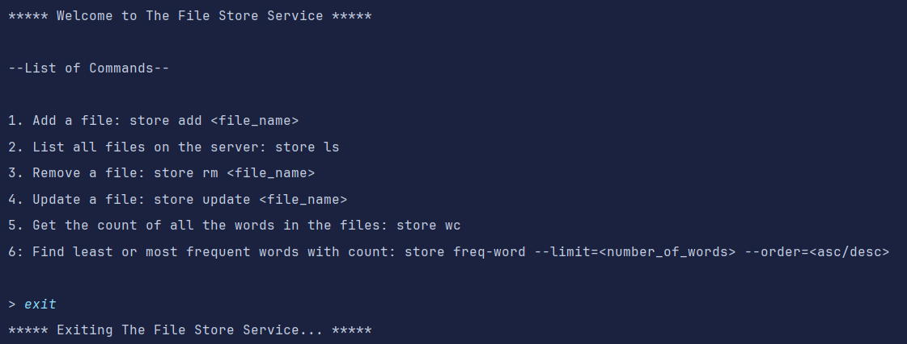
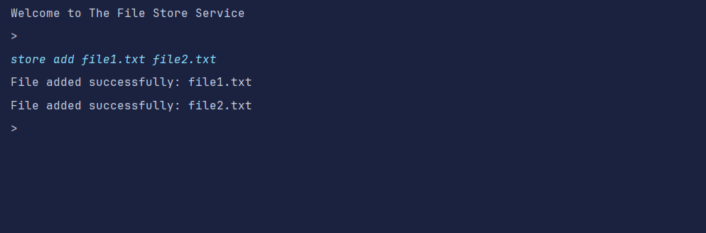
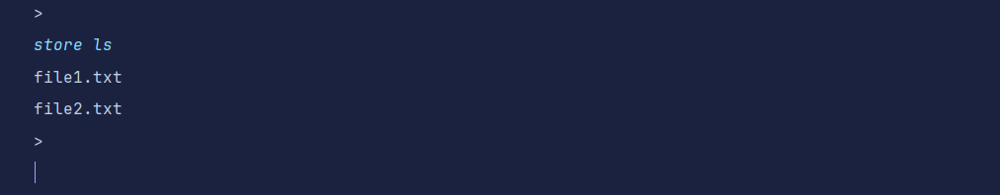
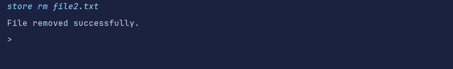
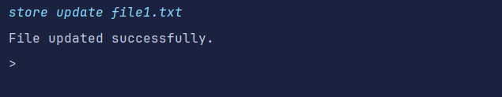
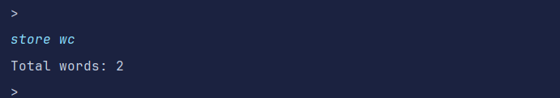
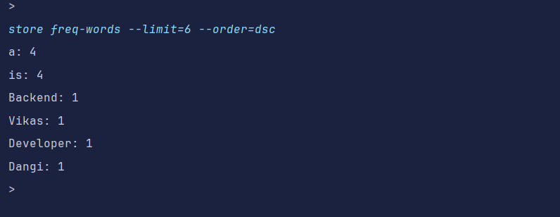

# File Store Service

A **File Store Service** that allows clients to manage plain-text files on a server using a command-line client. The service supports uploading, updating, deleting files, and performing operations such as word count and frequent word analysis.

## Features

### Core Operations
1. **Add Files**: Upload plain-text files to the server. Avoid sending duplicate content if a file with the same content already exists.
2. **List Files**: List all files currently stored on the server.
3. **Remove Files**: Delete a specific file from the server.
4. **Update Files**: Update the contents of a file or create it if it doesn't exist.

### Additional Operations
1. **Word Count**: Count the total number of words in all files.
2. **Frequent Words**: Find the most or least frequent words across all files with customizable limits and order.

### Optimizations
- Avoid redundant file uploads by comparing file hashes.

---

## Tech Stack

### Server
- **Framework**: Spring Boot
- **Language**: Java
- **Build Tool**: Maven
- **Storage**: Local file system

### Client
- **Language**: Java
- **Build Tool**: Maven

---

## Run The File Store Application

- Get the Docker images of client and server from below links:  
  [Client Image](https://hub.docker.com/repository/docker/dangivikas/file-store-client/general)  
  [Server Image](https://hub.docker.com/repository/docker/dangivikas/file-store-server/general)
  
  Pull the images and follow the below steps:  
  1. Put both the images on the same network for that first create a network:  
     *docker network create file-store-network*
  2. Run the server image on that network:  
     *docker run -d --name file-store-server --network file-store-network -p 8080:8080 file-store-server:latest*
  3. Run the client on the same network:  
     *docker run -it  --name file-store-client  --network file-store-network  -e SERVER_URL="http://file-store-server:8080/filestore" file-store-client:latest*

- To run the application directly by cloning the repository follow:
  1. Clone the repository.
  2. Navigate to the project directory to the directory where the project is cloned.
  3. Verify the project structure. Ensure that the project directory contains the necessary files and subdirectories, including a pom.xml file (Maven configuration file).
  4. Install dependencies - Run the command _mvn install_ to install the project’s dependencies. 
  5. Compile and package the application - Run the command _mvn compile_ to compile the Java code, and then _mvn package_ to package the application into a JAR file.
  6. Run the application - You can run the application using the command _java -jar (jar-file-name).
---

## Usage
### Command-Line Client
  
To add and update the files, please keep the required files in **_fileupload_** directory of the client.

- **Add Files**
   
Upload files to the server:

- **List Files**
   
List all files on the server:

- **Remove a File**
   
Delete a specific file:

- **Update a File**
   
Update a specific file:  

- **Word Count**
   
Count the total words in all files:  

- **Frequent Words**
   
Find the most frequent words:

---
## Authors
**Vikas Dangi**
