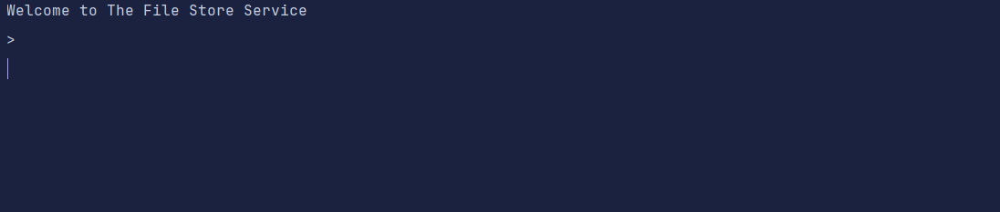

# File Store Service

A **File Store Service** that allows clients to manage plain-text files on a server using a command-line client. The service supports uploading, updating, deleting files, and performing operations such as word count and frequent word analysis.

## Features

### Core Operations
1. **Add Files**: Upload plain-text files to the server. Avoid sending duplicate content if a file with the same content already exists.
2. **List Files**: List all files currently stored on the server.
3. **Remove Files**: Delete a specific file from the server.
4. **Update Files**: Update the contents of a file or create it if it doesn't exist.

### Additional Operations
1. **Word Count**: Count the total number of words in all files.
2. **Frequent Words**: Find the most or least frequent words across all files with customizable limits and order.

### Optimizations
- Avoid redundant file uploads by comparing file hashes.

---

## Tech Stack

### Server
- **Framework**: Spring Boot
- **Language**: Java
- **Build Tool**: Maven
- **Storage**: Local file system

### Client
- **Language**: Java
- **Build Tool**: Maven

---

## Usage
### Command-Line Client
  
To add and update the files, please keep the required files in **_fileupload_** directory of the client.

- **Add Files**
   
Upload files to the server:

- **List Files**
   
List all files on the server:

- **Remove a File**
   
Delete a specific file:

- **Update a File**
   
Update a specific file:  

- **Word Count**
   
Count the total words in all files:  

- **Frequent Words**
   
Find the most frequent words:

---
## Authors
**Vikas Dangi**
